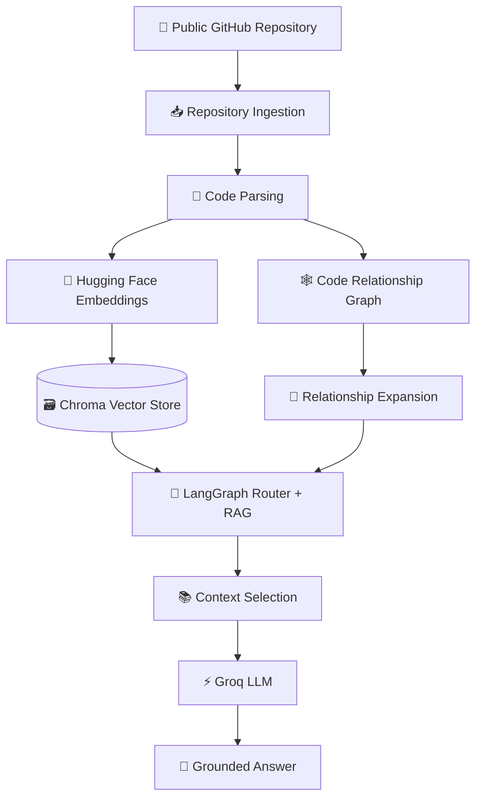
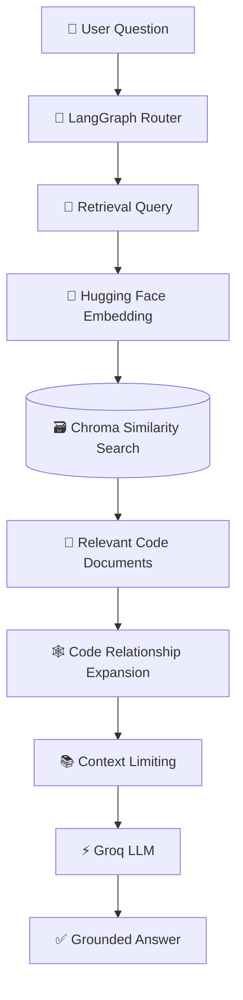
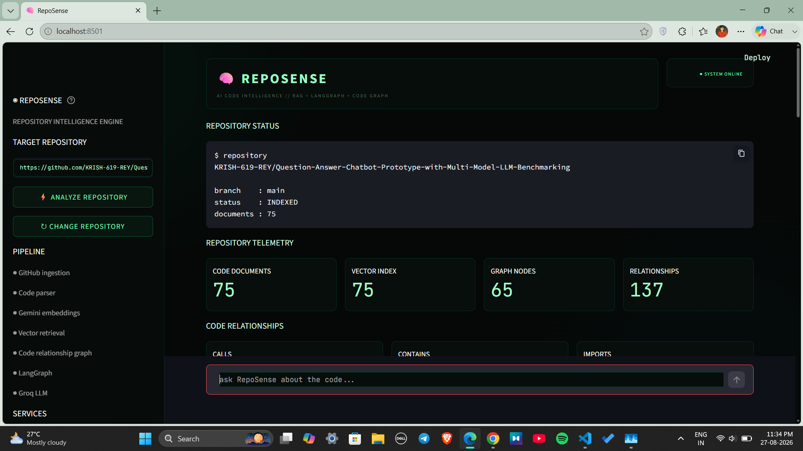
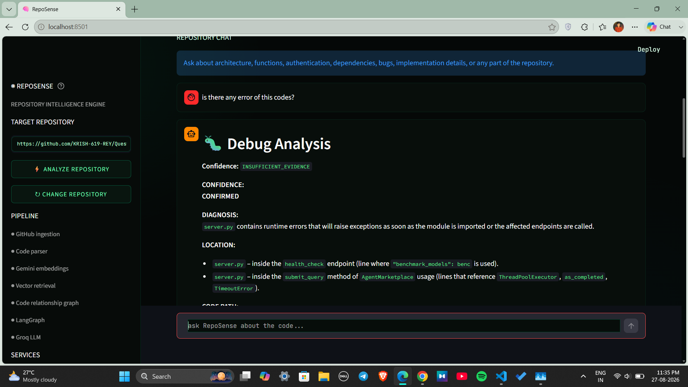

<div align="center">

# 🧠 RepoSense

### AI-Powered GitHub Repository Intelligence

**Understand any GitHub codebase using RAG, LangGraph, semantic search, code relationships, and LLM-powered reasoning.**

<br>


<br>

> 🔍 **Connect a public GitHub repository, index its codebase, and ask questions about the project using natural language.**

</div>

---

## 📌 Table of Contents

- [🌟 Overview](#-overview)
- [✨ Features](#-features)
- [🧠 How RepoSense Works](#-how-reposense-works)
- [🏗️ Architecture](#️-architecture)
- [🧩 Tech Stack](#-tech-stack)
- [📁 Project Structure](#-project-structure)
- [🔄 RAG Pipeline](#-rag-pipeline)
- [🕸️ Code Relationship Graph](#️-code-relationship-graph)
- [🐛 Debugging Intelligence](#-debugging-intelligence)
- [🔑 API Keys](#-api-keys)
- [🛠️ Installation](#️-installation)
- [🚀 Running the Application](#-running-the-application)
- [💬 Example Questions](#-example-questions)
- [🖥️ Screenshots](#️-screenshots)
- [🔐 Security](#-security)
- [🗺️ Future Improvements](#️-future-improvements)
- [🤝 Contributing](#-contributing)

---

# 🌟 Overview

**RepoSense** is an AI-powered GitHub repository intelligence platform that helps developers understand unfamiliar codebases through natural-language conversations.

Instead of manually navigating hundreds of files, users can provide a public GitHub repository and ask questions such as:

> 💬 *"Where is authentication implemented?"*

> 💬 *"Explain the main entry point."*

> 💬 *"Which files depend on this function?"*

> 💬 *"Find a potential bug in the login flow."*

RepoSense combines:

- 🔎 **Semantic code retrieval**
- 🧠 **Retrieval-Augmented Generation (RAG)**
- 🕸️ **Code relationship analysis**
- 🧭 **LangGraph-based routing**
- ⚡ **Groq LLM generation**
- 🤗 **Hugging Face embeddings**
- 🗃️ **Chroma vector storage**

This allows RepoSense to answer questions using not only semantically similar code, but also relationships between:

`functions` • `classes` • `imports` • `callers` • `dependencies`

---

# ✨ Features

<table>
<tr>
<td width="50%">

### 🔍 Repository Intelligence

- Analyze public GitHub repositories
- Repository-wide code understanding
- Semantic code search
- File-aware retrieval
- Source-code references

</td>
<td width="50%">

### 🧠 AI-Powered Analysis

- Retrieval-Augmented Generation
- Conversational repository chat
- LangGraph query routing
- Groq-powered responses
- Follow-up question support

</td>
</tr>

<tr>
<td>

### 🕸️ Code Relationships

- Function call relationships
- Import relationships
- Class/function containment
- Dependency discovery
- Related-code expansion

</td>
<td>

### 🐛 Debugging Intelligence

- Bug investigation
- Evidence-based reasoning
- Caller/dependency analysis
- Confidence levels
- Repository-grounded answers

</td>
</tr>
</table>

### Additional Capabilities

- 🤗 Hugging Face hosted embeddings
- 🗃️ Chroma vector database
- 🖥️ Streamlit web interface
- 🔐 User-provided API credentials
- 📊 Repository telemetry
- 🧪 Debugging logs
- 📚 Source file and line references

---

# 🧠 How RepoSense Works

RepoSense does more than send repository files directly to an LLM.

It builds a structured knowledge layer around the codebase.

```text
GitHub Repository
       │
       ▼
Repository Ingestion
       │
       ▼
Code Parsing
       │
       ├───────────────┐
       ▼               ▼
Semantic Index    Relationship Graph
       │               │
       └───────┬───────┘
               ▼
         LangGraph Router
               │
               ▼
          RAG Retrieval
               │
               ▼
        Context Selection
               │
               ▼
            Groq LLM
               │
               ▼
       Grounded Response
```

The result is a conversational AI system that can reason about both:

**what the code says** and **how different pieces of code are connected**.

---

# 🏗️ Architecture



### Architecture Flow

1. A public GitHub repository is provided.
2. RepoSense downloads and processes repository files.
3. Source code is parsed into retrievable documents.
4. Code is converted into semantic embeddings.
5. Embeddings are stored in Chroma.
6. Code relationships are extracted into a graph.
7. LangGraph determines how the user's query should be handled.
8. Relevant semantic and relationship-based evidence is collected.
9. Context is constrained before being sent to the LLM.
10. Groq generates a repository-grounded response.

---

# 🧩 Tech Stack

| Component | Technology |
|:---|:---|
| 🖥️ **Frontend / UI** | Streamlit |
| 🐍 **Language** | Python |
| ⚡ **LLM** | Groq |
| 🤗 **Embeddings** | Hugging Face Inference API |
| 🧠 **Embedding Model** | `sentence-transformers/all-MiniLM-L6-v2` |
| 🗃️ **Vector Database** | Chroma |
| 🧭 **AI Orchestration** | LangGraph |
| 🔎 **RAG Framework** | LangChain |
| 🐙 **Repository Source** | GitHub API |
| 🌳 **Code Parsing** | Python AST / Repository Parser |
| 🕸️ **Relationship Graph** | NetworkX |
| 🌐 **Application Type** | AI-powered Web Application |

---

# 📁 Project Structure

```text
RepoScense/
│
├── app/
│   │
│   ├── streamlit_app.py
│   │
│   ├── embeddings/
│   │   └── huggingface.py
│   │
│   ├── github/
│   │   └── client.py
│   │
│   ├── ingestion/
│   │   └── repository.py
│   │
│   ├── retrieval/
│   │   ├── indexer.py
│   │   └── vector_store.py
│   │
│   ├── analysis/
│   │   ├── code_parser.py
│   │   └── relationship_graph.py
│   │
│   ├── graph/
│   │   ├── state.py
│   │   ├── router.py
│   │   ├── nodes.py
│   │   └── workflow.py
│   │
│   ├── rag/
│   │   ├── chain.py
│   │   └── context.py
│   │
│   └── llm/
│       └── groq.py
│
├── tests/
│
├── requirements.txt
│
├── .gitignore
│
└── README.md
```

---

# 🔄 RAG Pipeline

RepoSense follows a structured retrieval pipeline.



### Pipeline Breakdown

```text
User Question
      │
      ▼
LangGraph Router
      │
      ▼
Retrieval Query
      │
      ▼
Hugging Face Embedding
      │
      ▼
Chroma Similarity / Hybrid Search
      │
      ▼
Relevant Code Documents
      │
      ▼
Code Relationship Expansion
      │
      ▼
Context Limiting
      │
      ▼
Groq LLM
      │
      ▼
Grounded Answer
```

RepoSense uses **bounded evidence and context** before sending repository information to the language model.

This helps:

- Reduce unnecessarily large prompts
- Improve response reliability
- Keep answers focused
- Reduce irrelevant repository context
- Improve grounding

---

# 🕸️ Code Relationship Graph

Semantic similarity alone may not reveal how code actually interacts.

RepoSense therefore builds relationships between important source-code entities.

### Supported Relationship Types

```text
imports
calls
contains
```

For example:

```text
authenticate_user()
        │
        ├──── calls ────▶ get_user()
        │
        ├── imports ────▶ database.users
        │
        └─ contains ────▶ validation logic
```

This allows RepoSense to retrieve neighboring or dependent code that may not be semantically similar to the user's original query.

### Why This Matters

Suppose a user asks:

> **"How does authentication work?"**

Semantic search may retrieve `authenticate_user()`.

The relationship graph can then additionally discover:

```text
authenticate_user()
        │
        ├── get_user()
        ├── validate_password()
        ├── database.users
        └── login endpoint
```

This gives the LLM more complete repository evidence.

---

# 🐛 Debugging Intelligence

RepoSense can investigate debugging questions by combining:

```text
Semantic Retrieval
        +
Related Code
        +
Callers / Dependencies
        +
Repository Evidence
        +
Constrained LLM Reasoning
```

Rather than treating every suspicious implementation as a confirmed bug, RepoSense can distinguish different levels of confidence.

| Level | Meaning |
|:---:|---|
| 🟢 **CONFIRMED** | Repository evidence strongly supports the issue |
| 🟡 **LIKELY** | Evidence suggests the issue is probably real |
| 🟠 **POSSIBLE** | A potential issue exists but evidence is limited |
| ⚪ **INSUFFICIENT_EVIDENCE** | Repository context is not enough to make a conclusion |

> [!IMPORTANT]
> A bug should not be considered **CONFIRMED** without supporting repository evidence.

This makes debugging responses more cautious and evidence-driven.

---

# 🔑 API Keys

RepoSense currently requires the following credentials:

| API | Required? | Purpose |
|---|:---:|---|
| 🤗 Hugging Face | ✅ Yes | Generate text embeddings |
| ⚡ Groq | ✅ Yes | LLM response generation |
| 🐙 GitHub Token | ⚪ Optional | Repository API access |

Users provide these credentials directly through the RepoSense interface.

---

## 🤗 Hugging Face API Key

RepoSense uses the **Hugging Face Inference API** to generate text embeddings.

### Create a Hugging Face Token

1. Create or sign in to your Hugging Face account.

2. Open:

```text
https://huggingface.co/settings/tokens
```

3. Select **Create New Token**.

4. Give the token the required **Inference Providers** permission.

5. Copy the generated token.

### Official Documentation

```text
https://huggingface.co/docs/inference-providers/tasks/feature-extraction
```

---

## ⚡ Groq API Key

RepoSense uses **Groq** for fast LLM inference and answer generation.

### Create a Groq API Key

1. Create or sign in to your Groq account.
2. Open the Groq Console.
3. Navigate to **API Keys**.
4. Create a new API key.
5. Copy your generated key.

### Official Quickstart

```text
https://console.groq.com/docs/quickstart
```

---

## 🐙 GitHub Repository

Enter the URL of any supported public GitHub repository.

Example:

```text
https://github.com/username/repository
```

A GitHub token is optional when working with public repositories.

---

# 🛠️ Installation

## 1️⃣ Clone the Repository

```bash
git clone [https://github.com/SoudipMondal12/RepoSense](https://github.com/SoudipMondal12/RepoSense)
cd RepoScense
```

---

## 2️⃣ Create a Virtual Environment

### 🪟 Windows

```powershell
python -m venv .venv
```

Activate:

```powershell
.venv\Scripts\Activate.ps1
```

### 🍎 macOS / 🐧 Linux

```bash
python3 -m venv .venv
```

Activate:

```bash
source .venv/bin/activate
```

---

## 3️⃣ Install Dependencies

```bash
pip install -r requirements.txt
```

---

# 🚀 Running the Application

Run RepoSense from the repository root:

```bash
streamlit run app/streamlit_app.py
```

Streamlit will start the application and display the local URL in your terminal.

Usually:

```text
http://localhost:8501
```

---

# 💬 Example Questions

Once the repository has been indexed, you can start chatting with the codebase.

### 📚 Repository Understanding

```text
What is the main purpose of this repository?
```

```text
Explain the architecture of this project.
```

```text
Explain the main entry point.
```

---

### 🔍 Code Discovery

```text
Where is authentication implemented?
```

```text
Where is the database connection created?
```

```text
Explain the AgentRegistry class.
```

---

### 🕸️ Dependency Analysis

```text
What files depend on this function?
```

```text
Which functions call this method?
```

```text
What modules are related to authentication?
```

---

### 🐛 Debugging

```text
Find a potential bug in the login flow.
```

```text
What happens if this function fails?
```

```text
Are there any possible issues with this implementation?
```

---

### 🚀 Code Improvement

```text
How would you improve this implementation?
```

```text
What parts of this architecture could be refactored?
```

```text
How can this code be made more maintainable?
```

---

### 💭 Follow-Up Questions

RepoSense also supports conversational follow-ups.

```text
Explain that function in more detail.
```

```text
What happens if that function fails?
```

```text
Which other files use it?
```

---

# 🖥️ Screenshots

<div align="center">

### 🏠 RepoSense Interface



<br><br>

### 💬 Repository Intelligence



</div>


---

# 🔐 Security

RepoSense is designed so users provide their own API credentials through the application.

### ⚠️ Important

Never commit API keys directly to GitHub.

Avoid storing credentials inside:

```python
GROQ_API_KEY = "your-secret-key"
HF_TOKEN = "your-secret-key"
```

Make sure sensitive files are excluded through `.gitignore` where appropriate.

Example:

```gitignore
.env
.venv/
__pycache__/
*.pyc
```

---

# 🧠 Why RepoSense?

Traditional repository search is mostly based on:

```text
Keyword Matching
```

RepoSense adds:

```text
Semantic Understanding
        +
Code Relationships
        +
Repository Context
        +
LLM Reasoning
```

Conceptually:

```text
Traditional Search
       ↓
"Find this text"


RepoSense
       ↓
"Understand how this code works"
```

This is especially useful when working with:

- Large unfamiliar repositories
- Open-source projects
- Legacy codebases
- Debugging workflows
- Developer onboarding
- Architecture exploration
- Dependency analysis

---

# 🗺️ Future Improvements

Potential future enhancements include:

- [ ] 🔐 Private GitHub repository support
- [ ] 🌍 Multi-language code parsing
- [ ] 🧠 Multiple embedding-model options
- [ ] 🕸️ Interactive dependency visualization
- [ ] 📊 Repository architecture dashboard
- [ ] 🔍 Advanced hybrid retrieval
- [ ] 🧪 Automated test analysis
- [ ] 🐛 Automated bug detection
- [ ] 📝 Automated repository documentation
- [ ] 🔄 Pull-request analysis
- [ ] 💾 Persistent repository indexes
- [ ] 👥 Multi-user sessions
- [ ] 📈 Repository quality metrics

---

# 🤝 Contributing

Contributions, ideas, bug reports, and improvements are welcome.

### Contribution Workflow

```bash
# Fork the repository

# Clone your fork
git clone https://github.com/YOUR_USERNAME/RepoScense.git

# Create a new branch
git checkout -b feature/your-feature-name

# Commit your changes
git commit -m "Add new feature"

# Push your branch
git push origin feature/your-feature-name
```

Then open a **Pull Request** on GitHub.

---

# ⭐ Support

If you find RepoSense useful, consider giving the repository a **⭐ Star**.

It helps support the project and makes it easier for other developers to discover.

---

<div align="center">

## 🧠 RepoSense

### Understand repositories. Explore relationships. Debug with evidence.

**Built with Python • LangChain • LangGraph • Chroma • Hugging Face • Groq • Streamlit**

<br>

Made with ❤️ for developers who want to understand code faster.

<br>

**⭐ Star the repository if you like the project! ⭐**

</div>
